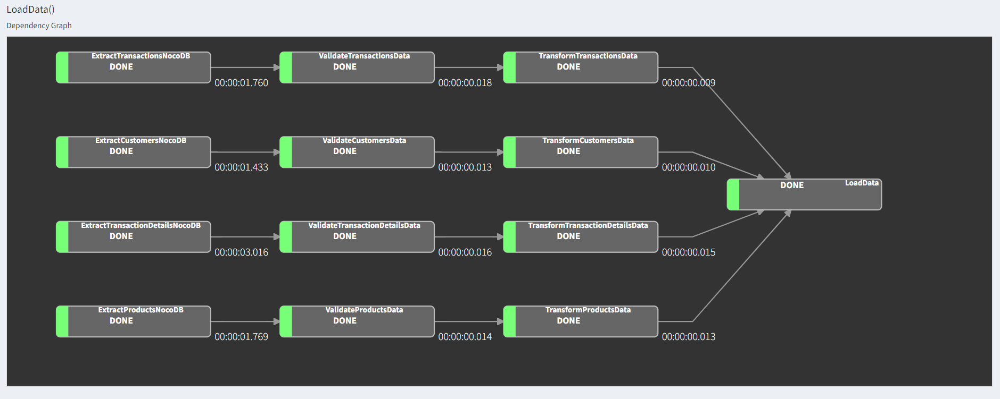

# Junior Program Luigi Pipeline

- Untuk menjalankan Luigi, pastikan install library terlebih dahulu dengan command

    ```bash
    pip install -r requirements.txt
    ```

- Nyalakan Luigi UI Server dengan menjalankan command

    ```bash
    luigid --port 8082 > /dev/null 2> /dev/null &
    ```

- Setelah itu, tinggal jalankan Luigi dengan command

    ```bash
    python -m luigi --module etl_process LoadData
    ```

Output:

